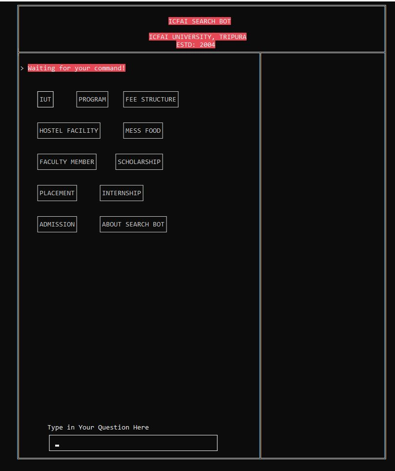

<h1 align="center">Chatbot by C language</h1>

# IUT Search Bot:
IUT Search Bot is a chatbot for The ICFAI University Tripura to help new students to know about the college.

-----
## Table of Contents:

* [IUT Search Bot Overview](#item1)
* [Installation Guide](#item2)
* [Screenshots](#item3)
-----

## IUT Search Bot Overview:
<h3>
IUT Search Bot is a chatbot for The ICFAI University Tripura to help new students to know about the college created by using C language. Students can know about fee structure, admission details, hostel facilities, mess food, faculty, scholarships, placements, internship etc.
</h3>
-----

## Installation Guide:

* [Step 1: Download the Repository](#step1)
* [Step 2: Run IUT SEACRCH BOT.c file](#step2)

-----

### Step 1: Download the Repository

Either Clone the repository using git clone: `gh repo clone biswajittt/IUT-Search-Bot`
or install via <a target="_blank" href="https://github.com/biswajittt/IUT-Search-Bot/archive/refs/heads/master.zip">zip</a> and extract 
to any of your folders you wish.

-----

### Step 2: Run IUT SEACRCH BOT.c file:

Simply run the .c file

-----

## Screenshots:

